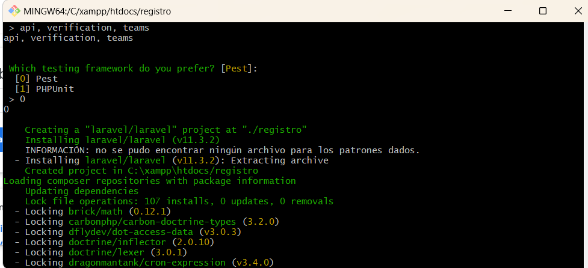
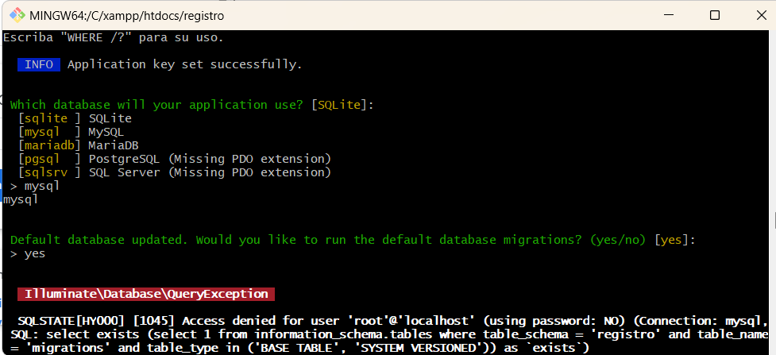
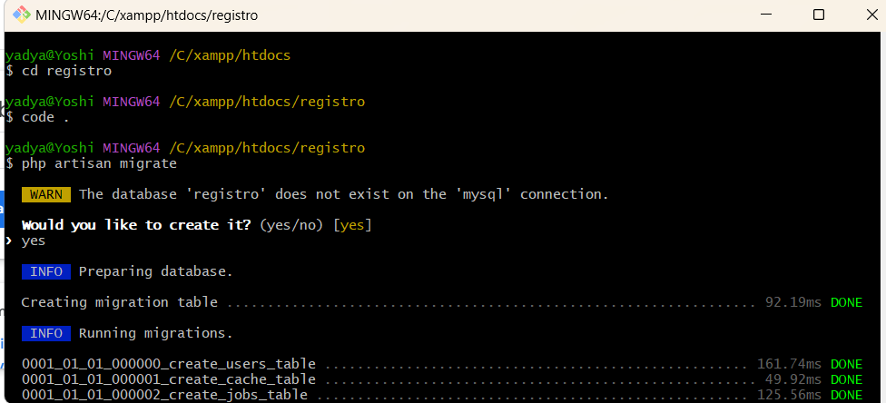
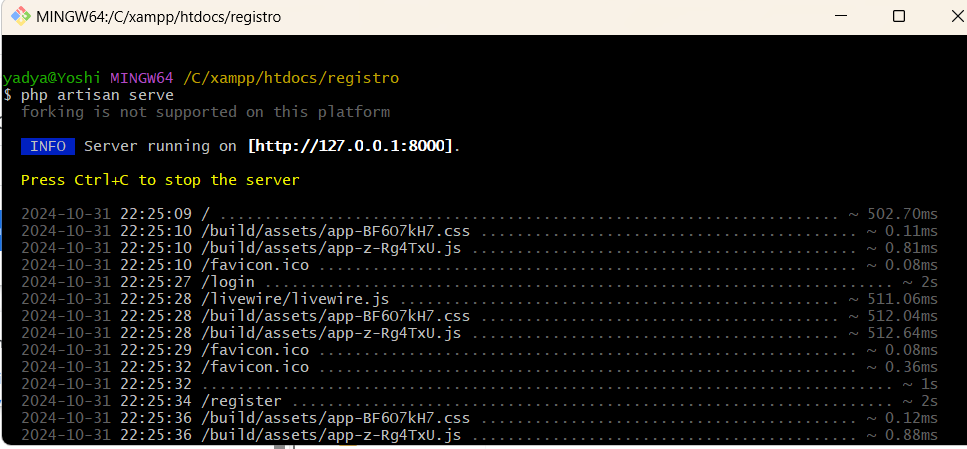
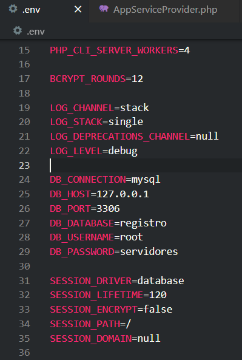
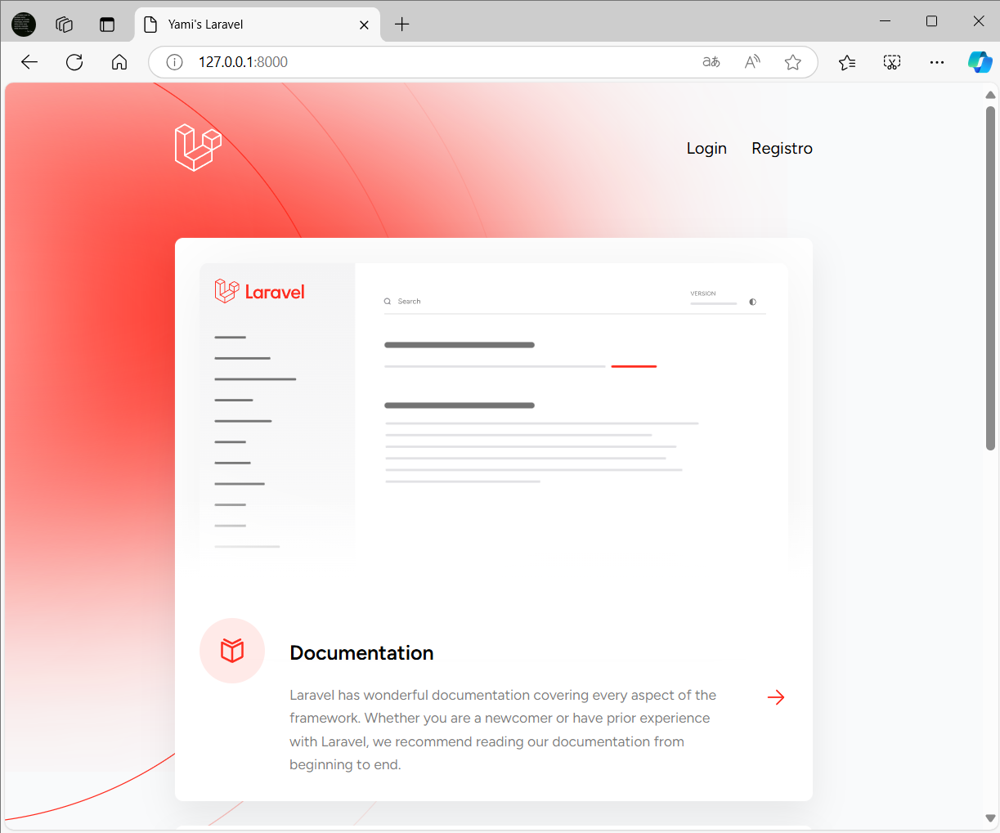
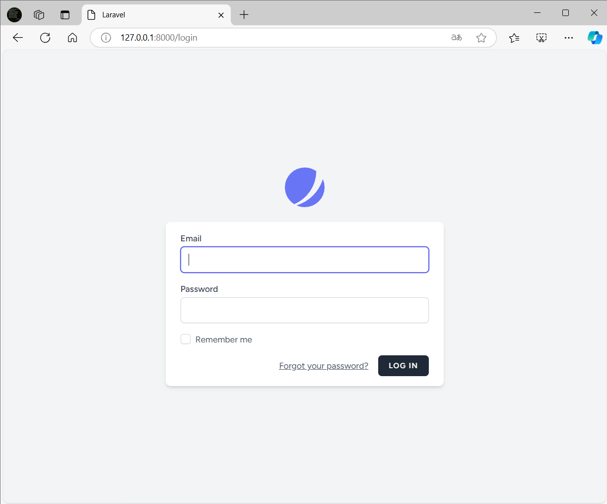
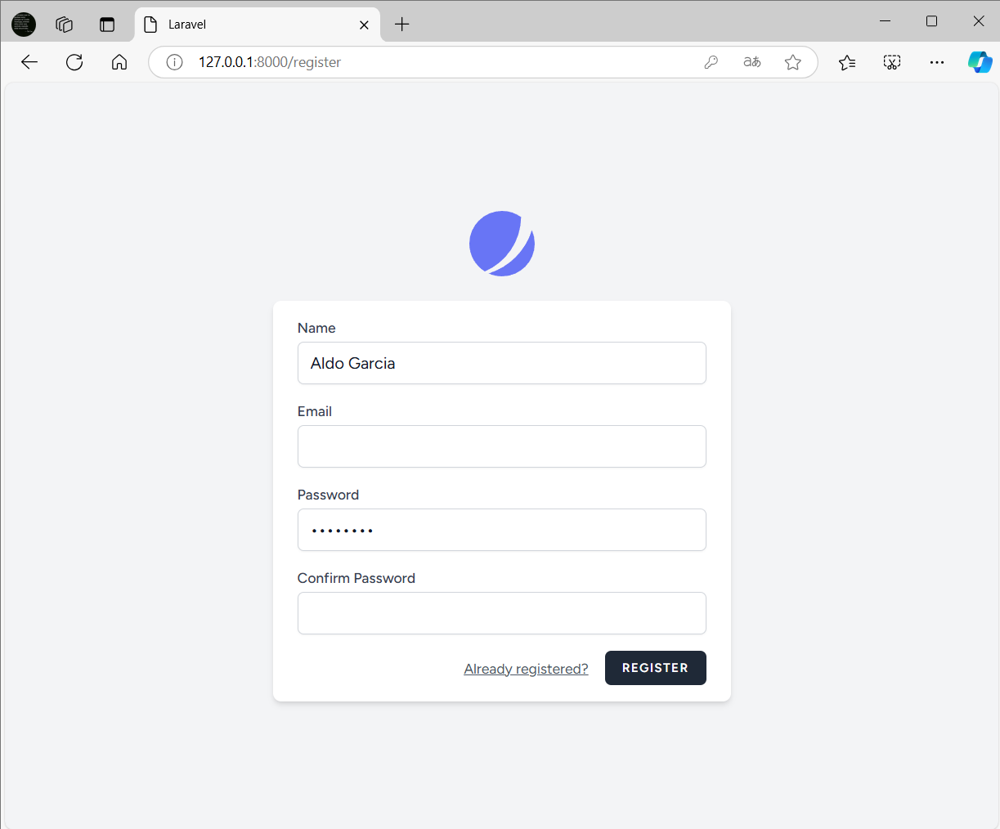
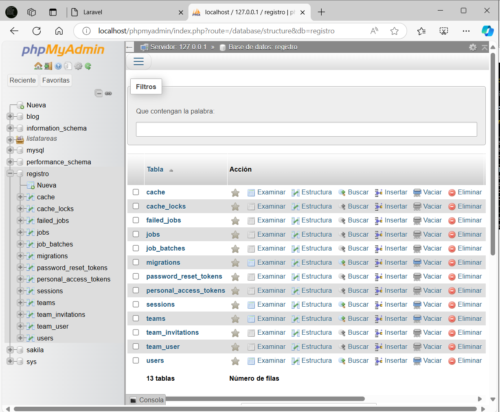
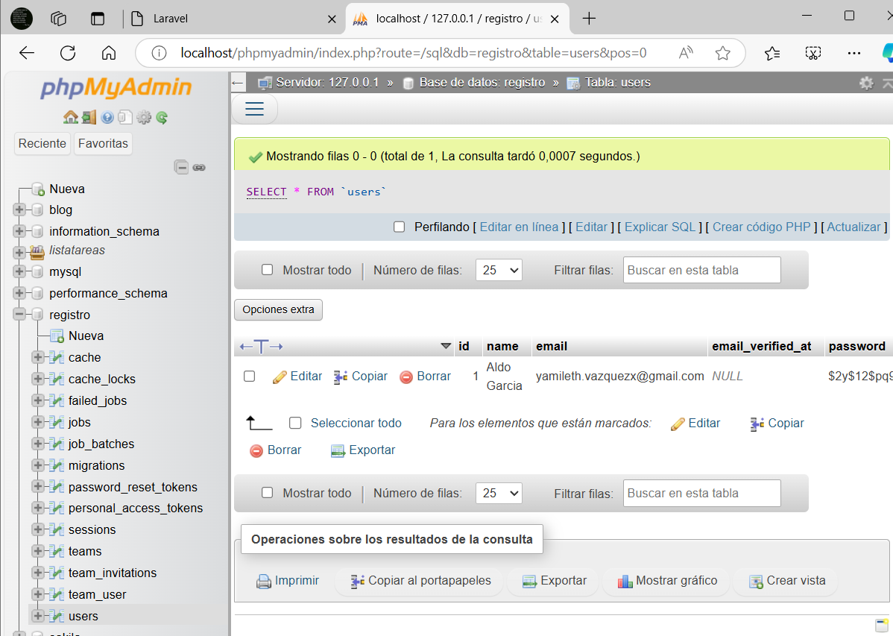

## Instalacion y proceso de creacion de Login y registro con JetStream de LARAVEL

Se necesitó tener XAMPP, MySQL, Composer, Git y Laravel, todos previamente descargados y configurados con versiones recientes.

## Entregables
Repositorio en GitHub e imagenes del proceso.

## 1.- Creación del proyecto con JetStream y especificaciones deseadas

## 2.- Selección de la base de datos a utilizar

## 3.- Una vez creado el proyecto, se migran los datos de la BD.

## 4.- Ejecucion del servidor

## 5.- Especificación de credenciales de la base de datos en el archivo .env del proyecto

## 6.- Cambio del nombre del proyecto y acceso a la página creada

## 7.- Login

## 8.- Registro

## 9.- Verificación de la base de datos en phpMyAdmin

## 10.- Verificación del registro exitoso en la base de datos

