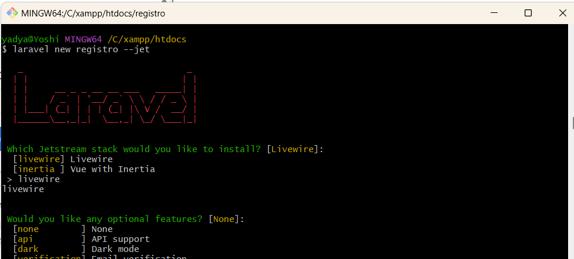

## Instalacion y proceso de creacion de Login y egistro con JetStream de LARAVEL

Lo que necesite fue tener Xampp, mysql, composer, git y laravel. Todo peviamente descargado y configurado cn versiones recientes.

## Entregables
Repositorio en GitHub e imagenes del proceso.

## 1.- Creamos un proyecto con jet y le vamos indicando las especificcaciones deseadas

